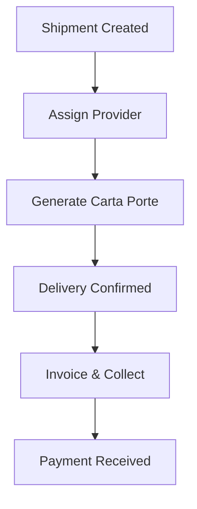

## Overview

Embarque provides a unified platform to manage shipments, SAT-compliant invoicing, collections, and operational workflows. You centralize all logistics operations to reduce errors, speed up collections, and ensure compliance with CFDI 4.0 and Carta Porte 3.1 standards.

<Columns cols={2}>
  <Card title="Embarques & Providers" icon="truck" href="/docs/embarques">
    Track shipments and manage providers in one dashboard.
  </Card>
  <Card title="SAT Facturación" icon="file-text" href="/docs/facturacion">
    Generate compliant CFDI and Carta Porte documents automatically.
  </Card>
  <Card title="Cobranza Tracking" icon="dollar-sign" href="/docs/cobranza">
    Monitor payments and automate follow-ups.
  </Card>
  <Card title="Workflow Automation" icon="zap" href="/docs/workflows">
    Streamline operations with custom alerts and roles.
  </Card>
</Columns>

## Embarques and Providers Module

Use the Embarques module to register shipments, assign providers, and track status in real-time. You create shipments with details like origin, destination, and cargo weight, then match them to trusted providers.

<Steps>
  <Step title="Create Shipment" icon="plus">
    Enter shipment details including client, route, and expected delivery date.

    ```javascript
    // Example API call to create a shipment
    const shipment = await fetch('https://api.embarque.mx/v1/shipments', {
      method: 'POST',
      headers: { 'Authorization': 'Bearer YOUR_TOKEN', 'Content-Type': 'application/json' },
      body: JSON.stringify({
        clientId: 'cli_123',
        origin: 'Monterrey',
        destination: 'CDMX',
        cargoWeight: 500
      })
    });
    ```
  </Step>
  <Step title="Assign Provider" icon="users">
    Select from your provider list or invite new ones via email integration.
  </Step>
  <Step title="Track Status" icon="map-pin">
    Monitor real-time updates with automated notifications.
  </Step>
</Steps>

<Callout kind="tip">
  Integrate with GPS providers for live tracking without additional setup.
</Callout>

## SAT Facturación with CFDI and Carta Porte

Embarque automates invoicing compliant with SAT regulations. Generate CFDI 4.0 for standard sales and Carta Porte 3.1 for shipments directly from shipment data.

<Tabs>
  <Tab title="CFDI 4.0" icon="file">
    Standard electronic invoices for services and goods.

    ```json
    {
      "serie": "A",
      "folio": "12345",
      "fecha": "2024-10-15T10:00:00",
      "subTotal": 1500.00,
      "total": 1860.00
    }
    ```
  </Tab>
  <Tab title="Carta Porte 3.1" icon="truck">
    Shipment-specific complements with transport details.

    ```json
    {
      "transporte": {
        "ubicacion": "Monterrey",
        "destino": "CDMX",
        "mercancia": [
          {
            "descripcion": "Electrónicos",
            "peso": "500kg"
          }
        ]
      }
    }
    ```
  </Tab>
</Tabs>

## Cobranza and Payments Tracking

Track accounts receivable with visibility into due dates, overdue amounts, and payment history. You set up automated reminders and escalate collections based on rules.

<CodeGroup tabs="Dashboard,API">
  ```javascript
  // Query overdue invoices via API
  const overdues = await fetch('https://api.embarque.mx/v1/invoices/overdue?days=30', {
    headers: { 'Authorization': 'Bearer YOUR_TOKEN' }
  });
  ```
  ```json
  // Dashboard filter example
  {
    "filter": "overdue > 30 days",
    "status": "pending"
  }
  ```
</CodeGroup>

## Operational Workflows and Automation

Automate repetitive tasks like shipment confirmation, invoice generation, and payment reminders. Define workflows that trigger based on events such as shipment delivery.



## Customization Options

Tailor Embarque to your team with role-based permissions and custom alerts.

<ExpandableGroup>
  <Expandable title="Roles and Permissions" default-open="true">
    Assign roles like Admin, Operator, or Accountant. Each role controls access to modules.

    | Role       | Embarques | Facturación | Cobranza |
    |------------|-----------|-------------|----------|
    | Admin      | Full     | Full       | Full    |
    | Operator   | Edit     | View       | None    |
    | Accountant | View     | Full       | Full    |
  </Expandable>
  <Expandable title="Custom Alerts">
    Set email or WhatsApp alerts for events like payment overdue or SAT rejection.
  </Expandable>
</ExpandableGroup>

<Callout kind="success">
  Start with default workflows and customize as your operations scale.
</Callout>