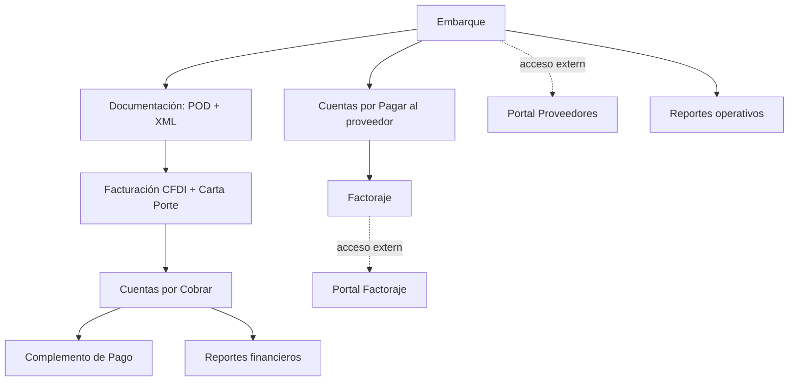

## Estructura del sistema

TMS Logística está organizado en módulos funcionales accesibles desde el menú lateral. El acceso a cada módulo depende de los permisos del rol del usuario.

<Columns cols={2}>
  <Card title="Embarques" icon="truck" href="/features/embarques">
    Núcleo operativo: ciclo de vida del embarque, paradas, documentos, gastos adicionales y BOL.
  </Card>
  <Card title="Facturación CFDI" icon="file-text" href="/features/facturacion">
    Timbrado CFDI 4.0 con Carta Porte 3.1, multi-RFC emisor, validación previa y manejo de errores SAT.
  </Card>
  <Card title="Cuentas por Cobrar" icon="dollar-sign" href="/features/cobranza">
    Pagos individuales y múltiples, complementos de pago, aging y notas de crédito.
  </Card>
  <Card title="Cuentas por Pagar" icon="credit-card" href="/features/cuentas-por-pagar">
    Facturas de proveedores, pagos, retenciones y comprobantes de pago.
  </Card>
  <Card title="Factoraje" icon="banknote" href="/features/factoraje">
    Operaciones con empresas de factoraje, comisiones, días de crédito y portal externo.
  </Card>
  <Card title="Reportes" icon="bar-chart-3" href="/features/reportes">
    11 reportes operativos y financieros con exportación a Excel.
  </Card>
  <Card title="Configuración" icon="settings" href="/features/configuracion">
    Razones sociales emisoras, tipos de cambio, penalizaciones y bitácoras del sistema.
  </Card>
  <Card title="Portales externos" icon="external-link" href="/features/portales">
    Acceso para proveedores y empresas de factoraje con guards independientes.
  </Card>
</Columns>

## Cómo se relacionan los módulos

## Capacidades transversales

<ExpandableGroup>
  <Expandable title="Multi-moneda MXN/USD" default-open="true">
    Embarques, facturas y pagos pueden expresarse en MXN o USD. El tipo de cambio se obtiene de la API de Banxico y se almacena en la tabla `tipos_cambio`. La cobranza calcula totales y aging por moneda de forma separada.
  </Expandable>
  <Expandable title="Multi-RFC emisor">
    El sistema soporta varias razones sociales emisoras (modelo `RazonSocialEmisora`) cada una con sus propias credenciales de FacturAPI o Facturama, encriptadas en base de datos.
  </Expandable>
  <Expandable title="Auditoría con Activity Log">
    Toda acción crítica queda registrada en `activity_log` (Spatie Activity Log): cambios de estado, edición de datos sensibles, cancelaciones, autorizaciones de costos y aprobaciones.
  </Expandable>
  <Expandable title="Permisos granulares">
    Más de 50 permisos individuales (Spatie Permission) controlan qué puede hacer cada rol. Ejemplos: `embarques.aprobarCostos`, `cxc.exportar`, `facturas.notaCredito`, `clientes.view-all`.
  </Expandable>
  <Expandable title="Buscador global">
    Combinación de teclas **Ctrl+K** (Windows/Linux) o **⌘+K** (macOS) abre el buscador global. Encuentra embarques, clientes, proveedores y facturas respetando los permisos del usuario.
  </Expandable>
  <Expandable title="Notificaciones internas">
    Las notificaciones del sistema se acumulan en el centro de notificaciones (campana en el header). Avisan de aprobaciones pendientes, vencimientos y cambios de estado.
  </Expandable>
</ExpandableGroup>

## Procesos en segundo plano

El sistema corre tareas asíncronas en cola para no bloquear la interfaz:

| Job | Cuándo se dispara |
|-----|-------------------|
| `EnviarComplementoPagoEmailJob` | Tras generar un complemento de pago, lo envía al cliente con PDF y XML adjuntos |
| `ConsultarEstatusSatJob` | Verifica el estatus de cancelación de una factura ante el SAT |
| `EnviarBOLProveedorJob` | Envía el Bill of Lading firmado al proveedor por correo |

<Callout kind="tip">
  La cola usa el driver `database`. En producción debe ejecutarse `php artisan queue:work` como proceso supervisado.
</Callout>

## Comandos programados

Se ejecutan vía `php artisan schedule:run` (cron del servidor):

| Comando | Propósito |
|---------|-----------|
| `cxc:actualizar-dias-vencidos` | Recalcula días vencidos en cuentas por cobrar |
| `cxp:actualizar-dias-vencidos` | Recalcula días vencidos en cuentas por pagar |
| `facturas:notificar-vencidas` | Envía correos de aviso por facturas vencidas |
| `facturas:descargar-faltantes` | Descarga PDF/XML faltantes de FacturAPI |
| `complementos:generar-automaticos` | Genera complementos de pago pendientes |
| `cancelaciones:verificar-pendientes` | Consulta el SAT por cancelaciones en proceso |
| `factoraje:sincronizar-pagos` | Sincroniza pagos del módulo de factoraje |
| `uploads:clean-temp` | Limpia archivos temporales subidos |

