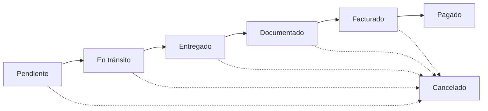

## Qué es un embarque

Un embarque representa una orden de transporte que TMS Logística administra como intermediario: tiene un cliente, un origen, un destino, un consignatario opcional, una mercancía y uno o más proveedores de transporte que ejecutan el movimiento.

<Callout kind="info">
  Los embarques se identifican por un **folio** generado automáticamente con prefijo según el tipo de servicio. El sistema soporta servicios nacionales e internacionales, con o sin agente aduanal.
</Callout>

## Ciclo de vida

| Estado | Significado |
|--------|-------------|
| Pendiente | Creado, esperando asignación o inicio |
| En tránsito | En camino, incluye carga y cruce de aduana |
| Entregado | Llegó al destino |
| Documentado | POD, Carta Porte y demás documentos completos |
| Facturado | CFDI emitido al cliente |
| Pagado | Cobrado |
| Cancelado | Estado terminal con auditoría y posibilidad de revertir |

## Crear y gestionar un embarque

<Steps>
  <Step title="Captura datos básicos" icon="edit">
    Cliente, origen, destino, mercancía, peso, volumen, valor declarado y referencia del cliente. Si aplica orden de compra del cliente, captura su número.
  </Step>
  <Step title="Define moneda y razón social emisora" icon="dollar-sign">
    Selecciona la moneda de facturación (MXN o USD) y la razón social emisora que timbrará la factura. Si es USD, el sistema sugiere el tipo de cambio Banxico del día.
  </Step>
  <Step title="Asigna proveedores" icon="users">
    Un embarque admite múltiples proveedores con tarifa, moneda y comisión propias. Cada combinación se registra en `embarque_proveedor`.
  </Step>
  <Step title="Captura paradas" icon="map-pin">
    Si hay paradas intermedias, agrégalas como **stops** con ubicación, fecha estimada y notas de tracking.
  </Step>
  <Step title="Configura impuestos" icon="percent">
    Indica si aplica IVA, retención de IVA o retención de ISR, con sus tasas. Estos valores se respetan al timbrar.
  </Step>
</Steps>

## Multiproveedor

<Callout kind="info">
  La relación embarque ↔ proveedor es **muchos a muchos** vía la tabla pivote `embarque_proveedor`. Esto permite escenarios como un tramo nacional con un transportista y un tramo internacional con otro.
</Callout>

Cada `EmbarqueProveedor` guarda:

- Tarifa pactada y moneda.
- Comisión negociada (afecta cálculos de margen).
- Indicador de si se paga vía factoraje y a qué empresa.
- Días de crédito otorgados.
- Estado de pago (pendiente, pagado_proveedor, pagado_tms).

## Documentación del embarque

<Tabs>
  <Tab title="POD" icon="file-check">
    El **Proof of Delivery** se sube como imagen o PDF. Cuando el POD físico viaja por mensajería, el sistema rastrea: solicitado → enviado por proveedor → recibido por TMS, con sus fechas.
  </Tab>
  <Tab title="Carta Porte del proveedor" icon="file-text">
    Si el proveedor emite la Carta Porte, su XML se sube y el sistema extrae automáticamente los datos relevantes para autollenar el embarque.
  </Tab>
  <Tab title="Carta Porte propia" icon="edit">
    Si TMS emite la Carta Porte directamente (sin XML del proveedor), el embarque se marca con `usa_carta_porte_propia` y los datos se editan desde el detalle.
  </Tab>
  <Tab title="Factura del proveedor" icon="receipt">
    El XML CFDI del proveedor se carga al embarque. Su UUID y monto se vinculan para conciliar contra cuentas por pagar.
  </Tab>
</Tabs>

## Carta Porte: campos editables

El detalle del embarque permite editar los datos del complemento Carta Porte sin volver a procesar el XML del proveedor. Los cambios se guardan como **overrides** en JSON dentro del campo `carta_porte_overrides`.

<ExpandableGroup>
  <Expandable title="Datos de mercancía" default-open="true">
    Clave de producto SAT (`c_ClaveProdServ`), clave de unidad SAT (`c_ClaveUnidad`), material peligroso, tipo de embalaje, peso en kg y fracción arancelaria.
  </Expandable>
  <Expandable title="Datos de transporte">
    Vehículo (placas, configuración), remolques, chofer (RFC y licencia), aseguradora ambiental cuando aplica.
  </Expandable>
  <Expandable title="Ubicaciones">
    Origen y destino con domicilio fiscal. Si hay paradas intermedias, cada parada tiene su propia ubicación.
  </Expandable>
  <Expandable title="Internacional">
    Cuando el embarque es internacional, se agregan régimen aduanero, pedimento, aduana de cruce, agente aduanal y descripción de materia.
  </Expandable>
</ExpandableGroup>

## Bill of Lading (BOL)

El BOL se genera con un token HMAC y URL pública con expiración. Se envía al proveedor por correo vía `EnviarBOLProveedorJob`.

<Callout kind="info">
  El BOL preview valida la firma HMAC antes de mostrar el contenido. Esto previene ataques de replay y enlaces compartidos sin autorización.
</Callout>

## Modificación de costo

Cuando un proveedor pide ajustar el costo pactado, el flujo es:

<Steps>
  <Step title="Solicitud" icon="edit">
    Operador o coordinador captura la solicitud con motivo y nuevo costo.
  </Step>
  <Step title="Token de autorización" icon="key">
    El sistema genera un token único con firma. Se envía por correo a quien tiene el permiso `embarques.aprobarCostos`.
  </Step>
  <Step title="Aprobación" icon="check">
    El aprobador abre el enlace, revisa el cambio y autoriza o rechaza. La acción queda en `activity_log`.
  </Step>
  <Step title="Aplicación" icon="save">
    Si se autoriza, el costo se aplica y los cálculos de margen y comisión se recalculan.
  </Step>
</Steps>

## Gastos adicionales

Conceptos como maniobras, almacenaje, demoras o detenciones se capturan como `GastoAdicionalEmbarque`. Tienen un flujo de aprobación independiente con el permiso `embarques.aprobarGastos`.

## Otras acciones del detalle

<Columns cols={2}>
  <Card title="Clonar" icon="copy">
    Duplica un embarque existente como base para uno nuevo. Pide confirmación para evitar clonaciones accidentales.
  </Card>
  <Card title="Revertir cancelación" icon="rotate-ccw">
    Reactiva un embarque cancelado y restaura su estado anterior, con auditoría completa.
  </Card>
  <Card title="Timeline de estados" icon="clock">
    Visualiza la línea de tiempo del embarque con cada cambio de estado, autor y fecha.
  </Card>
  <Card title="Notas de tracking" icon="message-square">
    Captura notas de seguimiento que el equipo y el cliente pueden ver.
  </Card>
</Columns>

## Permisos relacionados

| Permiso | Quién lo necesita |
|---------|-------------------|
| `embarques.view` / `embarques.viewOwn` | Lectura general o solo de embarques propios |
| `embarques.view-all` | Ver todos los embarques sin filtro de asignación |
| `embarques.create`, `embarques.edit`, `embarques.delete` | CRUD básico |
| `embarques.cancel` | Cancelar |
| `embarques.updateStatus` | Cambiar estado |
| `embarques.aprobarCostos` | Autorizar modificación de costo |
| `embarques.aprobarGastos` | Autorizar gastos adicionales |
| `embarques.editarReferencia` | Editar referencia del cliente después de creado |
| `embarques.editarPedimento` | Editar pedimento |
| `embarques.view-precios` | Ver precios y márgenes |
