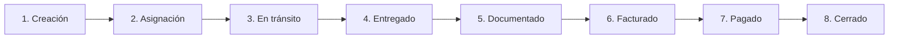

## Cómo leer esta guía

Cada paso indica **quién lo ejecuta** y **qué pasa en el sistema**. Sigue el orden — los embarques van de un estado al siguiente sin saltos.

## Fase 1 — Creación

**Quién:** Operador o Vendedor (con permiso `embarques.create`).

<Steps>
  <Step title="Capturar el embarque" icon="plus">
    El operador o vendedor abre **Embarques → Nuevo embarque**. Captura cliente, origen, destino, mercancía, peso, valor, moneda y razón social emisora.
  </Step>
  <Step title="Configurar impuestos y precio" icon="percent">
    Aplica IVA, retenciones (si el cliente las practica) y el precio pactado al cliente.
  </Step>
  <Step title="Guardar" icon="save">
    El embarque queda en estado **Pendiente** con folio asignado automáticamente. Aparece en el dashboard del operador asignado al cliente.
  </Step>
</Steps>

**Estado:** `Pendiente`. **Lo que hay:** datos del embarque, sin proveedor ni operación iniciada.

## Fase 2 — Asignación de proveedor

**Quién:** Operador.

<Steps>
  <Step title="Asignar proveedor" icon="users">
    Desde el detalle del embarque, sección de proveedores, agrega al transportista. Captura tarifa, moneda, comisión y días de crédito.
  </Step>
  <Step title="Capturar paradas si aplica" icon="map-pin">
    Si hay paradas intermedias, agrégalas como **stops**.
  </Step>
  <Step title="Generar BOL y Carta de Instrucciones" icon="file-text">
    Sigue [Generar BOL y carta de instrucciones](/help-center/guides/bol-carta-instrucciones). Envía ambos al proveedor.
  </Step>
</Steps>

**Estado:** sigue en `Pendiente`. **Lo que hay:** proveedor confirmado y documentos operativos enviados.

## Fase 3 — En tránsito

**Quién:** Operador (cambia estado), Customer Service (da seguimiento).

<Steps>
  <Step title="Iniciar operación" icon="play">
    Cuando el proveedor levanta la carga, el operador cambia el estado a **En tránsito** desde el timeline del embarque.
  </Step>
  <Step title="Capturar tracking" icon="map-pin">
    El customer service o el operador capturan notas de tracking conforme avanza el viaje. Las notas son visibles para el cliente.
  </Step>
  <Step title="Atender retrasos" icon="alert-triangle">
    Si hay retrasos, el customer service avisa proactivamente al cliente y registra causa, responsable y nueva fecha estimada.
  </Step>
</Steps>

**Estado:** `En tránsito`. **Lo que hay:** carga en movimiento, comunicación documentada.

## Fase 4 — Entregado

**Quién:** Operador (cambia estado), proveedor (sube POD).

<Steps>
  <Step title="Confirmar entrega" icon="check-circle">
    Al confirmar la entrega con el proveedor o el consignatario, el operador cambia el estado a **Entregado** y captura `fecha_entrega_real`.
  </Step>
  <Step title="Subir POD" icon="upload">
    El proveedor sube el POD digital desde su portal o lo envía por correo y el operador lo carga al embarque. Si el cliente exige POD físico, se inicia el flujo de seguimiento.
  </Step>
</Steps>

**Estado:** `Entregado`. **Lo que hay:** carga entregada con comprobante.

## Fase 5 — Documentado

**Quién:** Operador.

<Steps>
  <Step title="Recibir factura del proveedor" icon="receipt">
    El proveedor sube su CFDI desde su portal o lo envía por correo. El operador lo carga al embarque desde el detalle.
  </Step>
  <Step title="Recibir Carta Porte del proveedor" icon="file-text">
    El XML CFDI con complemento Carta Porte del proveedor se sube al embarque. El sistema extrae datos automáticamente.

    Si el proveedor no emite Carta Porte propia, el operador activa **Carta Porte Propia** y captura los datos manualmente.
  </Step>
  <Step title="Validar datos para facturar" icon="shield-check">
    El operador (o coordinador) revisa que los datos del cliente, mercancía y Carta Porte estén completos. Si hay solicitudes de modificación de costo o gastos adicionales pendientes, se aprueban en este punto.
  </Step>
  <Step title="Cambiar a Documentado" icon="play">
    Cuando todo está completo, el operador avanza el estado a **Documentado**. El embarque queda en la cola de Finanzas.
  </Step>
</Steps>

**Estado:** `Documentado`. **Lo que hay:** todos los papeles listos para facturar al cliente.

## Fase 6 — Facturado

**Quién:** Finanzas.

<Steps>
  <Step title="Abrir pre-factura" icon="file-text">
    El equipo de Finanzas abre el embarque en estado **Documentado** y va a **Pre-factura**.
  </Step>
  <Step title="Revisar conceptos y Carta Porte" icon="search">
    Verifica conceptos, impuestos, gastos adicionales aprobados y los 14 campos editables de Carta Porte.
  </Step>
  <Step title="Validar" icon="shield-check">
    El sistema valida contra el catálogo SAT antes de timbrar. Si detecta CP116, CP143, CP147, CP149, CP155, CP170, CP171 o CP172, bloquea con explicación.
  </Step>
  <Step title="Timbrar" icon="zap">
    Llamada a FacturAPI. Si pasa, se descarga PDF y XML. El embarque pasa a **Facturado**.
  </Step>
  <Step title="Enviar al cliente" icon="send">
    Finanzas envía la factura al cliente por correo desde el detalle.
  </Step>
</Steps>

**Estado:** `Facturado`. **Lo que hay:** CFDI emitido, cliente recibió la factura.

## Fase 7 — Pagado

**Quién:** Finanzas (al recibir el pago), Vendedor (da seguimiento a cobranza).

<Steps>
  <Step title="Aplicar el pago del cliente" icon="dollar-sign">
    Cuando tesorería confirma la transferencia, Finanzas aplica el pago en **Cuentas por Cobrar** siguiendo [Registrar un pago](/help-center/guides/registrar-pago).
  </Step>
  <Step title="Generar complemento si aplica" icon="receipt">
    Si la factura es PPD, Finanzas genera el complemento de pago siguiendo [Generar complemento de pago](/help-center/guides/complemento-pago).
  </Step>
  <Step title="Embarque pasa a Pagado" icon="check">
    Cuando el saldo de la factura llega a cero, el embarque pasa a estado **Pagado**.
  </Step>
</Steps>

**Estado:** `Pagado`. **Lo que hay:** dinero del cliente recibido y registrado en CFDI.

## Fase 8 — Cierre del lado proveedor

**Quién:** Finanzas (paga al proveedor o coordina con factoraje).

<Tabs>
  <Tab title="Pago directo al proveedor" icon="banknote">
    <Steps>
      <Step title="Cumplir plazo">
        Al cumplirse los días de crédito pactados con el proveedor, Finanzas registra el pago.
      </Step>
      <Step title="Aplicar pago en CxP">
        Cuentas por Pagar → factura del proveedor → **Registrar pago**. Aplica retenciones si corresponden.
      </Step>
      <Step title="Generar comprobante">
        El sistema produce el PDF de comprobante de pago para el proveedor.
      </Step>
    </Steps>
  </Tab>
  <Tab title="Vía empresa de factoraje" icon="layers">
    <Steps>
      <Step title="Empresa paga al proveedor">
        La empresa de factoraje paga al proveedor desde su portal externo. Estado de la operación pasa a `pagado_proveedor`.
      </Step>
      <Step title="Embarque paga a la empresa">
        Al cumplirse el plazo de crédito (típicamente 60 días), Finanzas paga a la empresa de factoraje. Estado pasa a `pagado_tms`.
      </Step>
      <Step title="Ciclo cerrado">
        Las tres partes (cliente, proveedor, factoraje) están conciliadas.
      </Step>
    </Steps>
  </Tab>
</Tabs>

## Métricas que mide cada fase

| Fase | Métrica clave |
|------|---------------|
| 1-2 Creación y asignación | Tiempo desde solicitud del cliente hasta embarque creado |
| 3-4 Tránsito y entrega | % entregas a tiempo |
| 5 Documentación | Tiempo entre Entregado y Documentado |
| 6 Facturación | Tiempo entre Documentado y Facturado; tasa de aceptación SAT |
| 7 Cobranza | DSO (días promedio de cobro) |
| 8 Pago al proveedor | % pagos en plazo |

## Quién ve el embarque en cada fase

| Fase | Operador | Vendedor | CS | Finanzas | Coordinador |
|------|----------|----------|----|----------|-------------| 
| 1 Creación | ✓ | ✓ | ✓ | — | ✓ |
| 2 Asignación | ✓ | — | — | — | ✓ |
| 3 Tránsito | ✓ | — | ✓ | — | ✓ |
| 4 Entregado | ✓ | — | ✓ | — | ✓ |
| 5 Documentado | ✓ | — | — | ✓ | ✓ |
| 6 Facturado | — | ✓ (cobranza) | — | ✓ | — |
| 7 Pagado | — | ✓ (comisión) | — | ✓ | — |
| 8 Cierre proveedor | — | — | — | ✓ | — |

## Si algo se sale del flujo

<ExpandableGroup>
  <Expandable title="Cancelación del embarque" default-open="true">
    En cualquier fase antes de **Pagado**, el embarque puede cancelarse con motivo. Si ya fue facturado, se cancela también la factura siguiendo [Cancelar una factura](/help-center/faq/cancelar-factura).
  </Expandable>
  <Expandable title="Retraso significativo">
    Customer Service captura motivo y comunica al cliente. El embarque sigue su flujo pero queda marcado con `tiene_retraso`.
  </Expandable>
  <Expandable title="Problemas al timbrar">
    Sigue [Errores de timbrado SAT](/help-center/troubleshooting/errores-sat). El embarque vuelve a editarse, se corrige y se reintenta.
  </Expandable>
  <Expandable title="Cliente disputa el monto">
    Antes de cobrar: ajusta antes de timbrar.
    Después de cobrar parte: emite **nota de crédito** para reducir el saldo.
    Después de cobrar todo: complejo — coordina con el cliente y considera reembolso si procede.
  </Expandable>
</ExpandableGroup>

## Siguiente paso

<Columns cols={2}>
  <Card title="Embarque internacional" icon="globe" href="/tutoriales/embarque-internacional" horizontal>
    Mismo flujo más agente aduanal, pedimento y régimen aduanero.
  </Card>
  <Card title="Tutoriales por rol" icon="users" href="/tutoriales" horizontal>
    Profundiza en lo que hace cada rol en cada fase.
  </Card>
</Columns>
